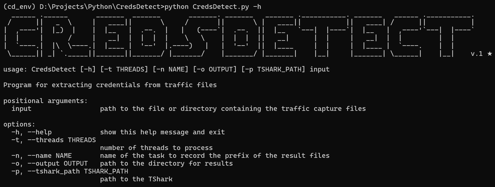

# CredsDetect

CredsDetect is a network traffic analysis crossplatform tool that allows you to receive credentials transmitted in clear text, as well as which allows you to extract authentication protocol hashes.

This project is inspired by the idea of improving and increasing productivity compared to similar projects. The main focus is on the use of multiprocessing and efficient processing of network packets. CredsDetect is aimed at processing large amounts of data. Each file is processed in a separate stream, while algorithms for optimized buffering of data packets are used, which saves RAM and achieves maximum performance. It using the Pyshark library ( https://github.com/KimiNewt/pyshark.git ), which allows you to use the full potential of Wireshark modules. This significantly reduced the data processing time.

#### At this stage, the following protocols are supported:
- Kerberos (asreq, asrep, tgsrep)
- NetNTLM (v1, v2, LM response)
- POP
- IMAP
- SMTP
- HTTP Basic Authentication
- HTTP Proxy
- FTP

The project is under development, new protocols will be added soon.

## Installation

Supports all modern versions of tshark / wireshark but certain features may be unavailable on older versions.

Creating a temporary python environment:
```console
python -m venv cd_env
```
Activate the virtual environment

on Windows:
```console
cd_env\Scripts\activate
```
on macOS and Linux:
```console
source myenv/bin/activate
```
Install requirements from file:
```console
pip install -r requirements.txt
```
```console
python CredsDetect.py -h
```


## Usage
CredsDetect uses the TShark module in the process. You must install it yourself from the official website ( https://www.wireshark.org  ) and specify CredsDetect using the "-p, --tshark_path TSHARK_PATH " flag, the path to the executable file that will be automatically saved in the configuration file, it is also possible to add the path to tshark to the environment variables, then it is not necessary to specify the path explicitly.

```console
python CredsDetect.py -p "C:\Program Files\Wireshark\tshark.exe" F:\folder_with_traf
```
Path to Tshark save in config.txt

```console
python CredsDetect.py -t 8 -n test1 -o results1 F:\folder_with_traf
```

#### CredsDetect displays all received data in a format supported by hashcat.

Kerberos

| packet\etype | 17    | 18    | 23   |
|--------------|-------|-------|------|
| asreq        | 19800 | 19900 | 7500 |
| asrep        | 32100 | 32200 | 18200|
| tgsrep       | 19600 | 19700 | 13100|

NetNTLM

| packet\version | v1   | v2   |
|----------------|------|------|
| response       | 5500 | 5600 |
